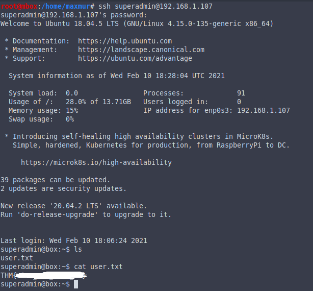
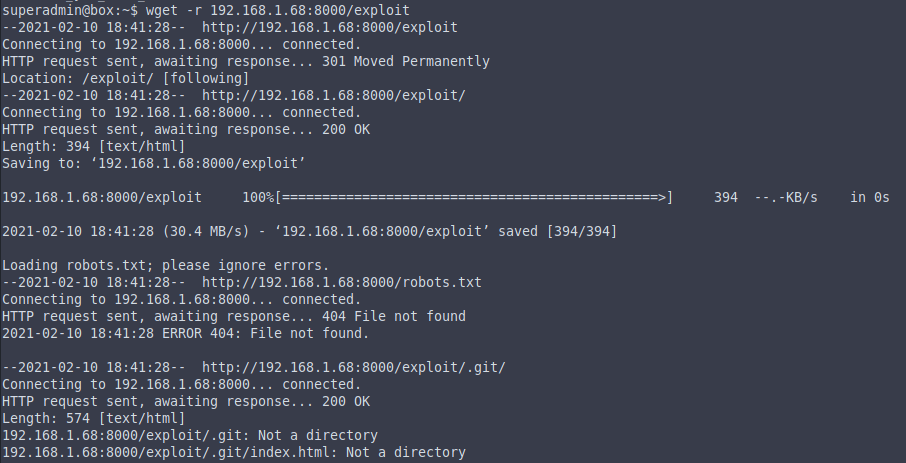

# Official TryHackMe Bad Admin WriteUp

First -- scan machine with nmap:

```bash
nmap -p- -A <MACHINE_IP>
```


Go on site in your browser


Scan directories on this site

```
gobuster dir -u <MACHINE_IP> -w /usr/share/wordlists/dirb/big.txt
```


Go to secter


Download image, and use steghide

```bash
steghide extract -sf find.jpg
```


Go to imgur


Download barcode, and [decode](https://zxing.org/w/decode.jspx)


Login ssh with this data



Use [CVE-2021-3156 PoC by blasty](https://github.com/blasty/CVE-2021-3156) or [Sudo 1.9.5p1 - 'Baron Samedit ' Heap-Based Buffer Overflow Privilege Escalation](https://www.exploit-db.com/exploits/49521) for PrivEsc




Compile the exploit

```
cd exploit
make
```


Run the exploit


Capture the flag


